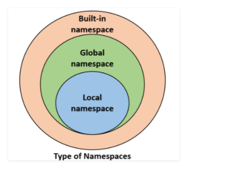

# Namespaces and Scope in Python

- A namespace is a system that has a unique name for each and every object in Python


- **An object might be a variable or a method.** Python itself maintains a namespace in the form of a Python dictionary.

- the Python interpreter understands what exact method or variable one is trying to point to in the code, depending upon the namespace.
- **So, the division of the word itself gives a little more information. Its Name (which means name, a unique identifier) + Space(which talks something related to scope). Here, a name might be of any Python method or variable and space depends upon the location from where is trying to access a variable or a method**

## Types of namespaces :

- When Python interpreter runs solely without any user-defined modules, methods, classes, etc. Some functions like print(), id() are always present, these are built-in namespaces. 


- When a user creates a module, a global namespace gets created, later the creation of local functions creates the local namespace.




## The lifetime of a namespace :

- A lifetime of a namespace depends upon the scope of objects, if the scope of an object ends, the lifetime of that namespace comes to an end. 
- Hence, it is not possible to access the inner namespace’s objects from an outer namespace.

```python
# var1 is in the global namespace
var1 = 5
def some_func():
 
    # var2 is in the local namespace
    var2 = 6
    def some_inner_func():
 
        # var3 is in the nested local
        # namespace
        var3 = 7
```