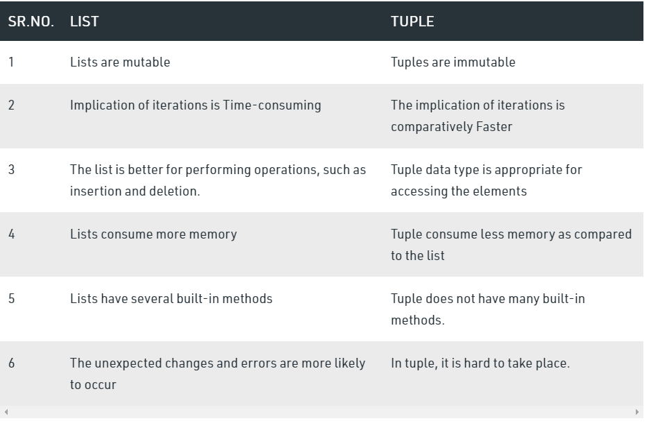

# tuples
- an ordered sequence of elements
- can mix element types  
- tuples are list which cannot be changed, i.e. **it's immutable in nature**
- its compound data types
- The tuple is faster than the list because of **static** in nature.

```python
tuple_data = ('this', 'is', 'an', 'example', 'of', 'tuple')
``` 

#### tuple vs list:




#### printing tuples

```python
tup1=(1,2,3)
print(tup1)

print(tup1[1]) # prints index 1
```
output:
```text
(1, 2, 3)
2
```

#### modifying tuple: this will result in error

```python
tup1=(1,2,3)
print(tup1)

# here we are modifying tuples which is immutable
tup1[2] = 43

```
Error output:
```text
(1, 2, 3)
Traceback (most recent call last):
  File "D:\lggram\python_projects\otter\com\nit\samples\sample1.py", line 6, in <module>
    tup1[2] = 43
TypeError: 'tuple' object does not support item assignment
```

#### converting tuple to list:

```python
tup1=(1,2,3)
print(tup1)

# convert to list
list1 = list(tup1)

# here we are modifying tuples which is immutable
list1[2] = 43

print(list1)
```

```text
(1, 2, 3)
[1, 2, 43]
```

#### slicing tuple

example1:

```python
tup1=(1,2,3,4,5,6)
print(tup1)

# slicing tuple
print(tup1[1:3])
```
```text
(1, 2, 3, 4, 5, 6)
(2, 3)
```

example2:
```python
tup1=(1,"mit", 6,7)
print(tup1)

# adding tuple
print(tup1[1:3])
```

```text
(1, 'mit', 6, 7)
('mit', 6)
```

#### adding tuples

```python

tup1=(1,"mit", 6,7)
tup2=(2,3,"nit")

print(tup1+tup2)
```
```text
(1, 'mit', 6, 7, 2, 3, 'nit')
```

#### used to return more than one value from function

```python
def quotient_and_remainder(x,y):
    q= x // y
    r= x % y

    return (q, r)

(quot,rem) = quotient_and_remainder(4,5)

print((quot,rem))
```

output:
```text
(0, 4)
```